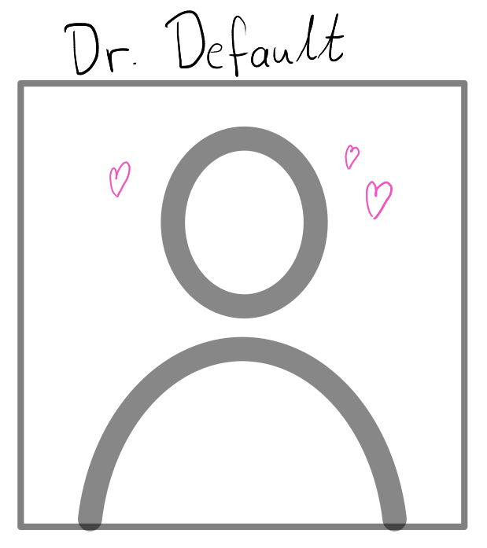

The year is 2025; I'm presenting my work on [prefio](https://github.com/fleverest/prefio/) at our departments annual workshop [WOMBAT](https://wombat2025.numbat.space/).

As the day progressed, I witnessed slide after slide with carefully chosen colour schemes, thoughfully placed graphics, and curated typesetting.

When it came my turn to present, I stared longingly at my slides, the beauty of which I had nary a passing thought over the preceding weeks.

"How embarassing"---I thought...

I had left my slides on the default Quarto RevealJS theme when every other speaker had overridden these settings in favour of their own custom designs.

At the time, I felt embarassed being the odd one out. But I have had a year to reflect on this incident, and so I am writing these reflections in the form of this blog. In fact I am creating this blog for this exact reason. It is of utmost importance that I share my new insights with the world---on my blog that nobody reads.

It is a little known fact that, at least in the days before AI took control of the internet, default settings were written by a person. Thus, when we override a default setting we convey not only that we care for the presentation of our work, but moreso that we do not care for the vision of the author of the software.

When we override a default we are actively erasing something that a great deal of thought, *even love*, has poured into. So rather than setting my slides backgrounds to a tasteful dark mode, in the future I will proudly display the original vision of the creator[^1].

So the next time you are urged to override a default argument, just ask yourself: what would the software author say about this?

[^1]: Actually it turns out that Quarto overrides the dark default of the [original RevealJS author](https://github.com/hakimel). However, they use the default background hex `#191919` without citation. Surely they are not the first to do so, so perhaps they deserve it...
